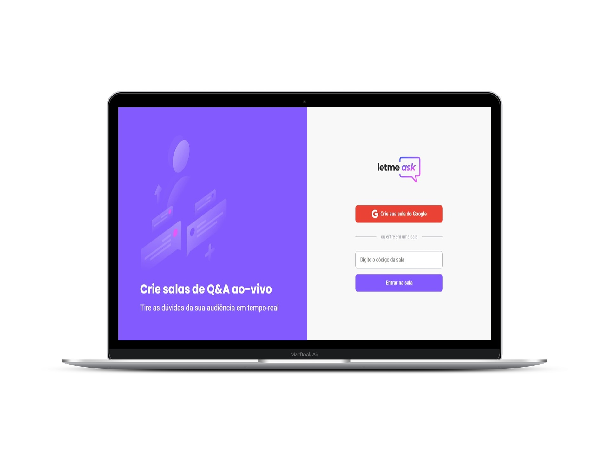

<p align="center">
  
</p>

<p align="center">
  
</p>

## 💻 Sobre o projeto

O Letmeask é uma aplicação pensada para os criadores de conteúdo em plataformas de streaming, visando oferecer uma solução agradável e organizada para melhorar a interação entre streamer e seu público.

Com o Letmeask, o streamer poderá criar salas de Q&A, onde ele recebe as perguntas dos telespectadores em tempo real. Os usuários da sala podem fazer livremente suas perguntas, porém caso alguma pergunta já tenha sido realizada, há a opção de **curtir** perguntas de outros usuários, evitando um flood.

O dono da sala (streamer) responderá essas perguntas, e assim que dada a resposta, poderá marcar a questão como **respondida**, ou se uma pergunta não agradar, for repetida, ou até mesmo ofensiva, poderá ser **deletada** pelo streamer dono da sala.

Este projeto foi desenvolvido durante a **[Next Level Week Together](https://nextlevelweek.com/)**, apresentada dos dias 20 a 27 de Junho de 2021. Trilha React ministrada por Diego Fernandes, CTO da Rocketseat.

## 🧪 Tecnologias

Esse projeto foi desenvolvido com as seguintes tecnologias:

- React[React](https://reactjs.org)
- [Firebase](https://firebase.google.com/)
- [TypeScript](https://www.typescriptlang.org/)
- [Sass]()

## 🚀 Como utilizar

Clone o projeto e acesse a pasta do mesmo.

```bash
$ git clone https://github.com/victordlmoraes/letmeask
$ cd letmeask
```

Para iniciá-lo, siga os passos abaixo:

```bash
# Instalar as dependências
$ yarn

# Iniciar o projeto
$ yarn start
```

A aplicação então estará disponível no seu browser pelo endereço http://localhost:3000.

**IMPORTANTE:** é necessário possuir uma conta no Firebase, bem como um projeto criado para disponibilizar um Realtime Database. Crie sua conta no Firebase clicando [AQUI](https://firebase.google.com/)

